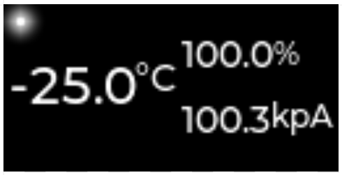

# Platformio XIAO ESP32S3 Meteo Station Exploration
This exploration project is to showcase the integration of a Bosch BME688 sensor with the Grove Expansion Board Base for XIAO and its SSD1306 LCD screen.
The measured ambient paramters are displayed on the LCD screen continuously.
For now, the "is station connected led" just blinking continously for the show case.

Need at least to configure LVGL to use the FreeRTOS port and the proper fonts.
Run menuconfig -> Component config -> LVGL configuration:
1.  -> Operating System (OS) -> Default operating system to use (2: FreeRTOS).
2.  -> Font Usage -> Enable built-in fonts -> MONTSERRAT_12, MONTSERRAT_14, and MONTSERRAT_20.
Other menuconfig setups:
1. 8MB Flash (XIAO ESP32S3 is 8MB, not 2MB).

This project is also using EEZ Studio and framework to configure the UI and allow for state flow logic to be implemented in it.
Here's an example of the LCD display in room ambient temperature:

# Seeed Xiao ESP32-S3 references:
https://docs.platformio.org/en/latest//boards/espressif32/seeed_xiao_esp32s3.html
https://wiki.seeedstudio.com/xiao_esp32s3_getting_started/
https://wiki.seeedstudio.com/Seeeduino-XIAO-Expansion-Board/

# Debug on Windows:
References https://community.platformio.org/t/how-to-use-jtag-built-in-debugger-of-the-esp32-s3-in-platformio/36042 and https://mydicedevice.com/?p=514.
1. Install latest version of "Espressif - WinUSB support for JTAG (ESP32-C3/S3)" driver https://docs.espressif.com/projects/esp-idf/en/latest/esp32s3/api-guides/jtag-debugging/configure-builtin-jtag.html.
2. Download Zadig https://zadig.akeo.ie/.
3. In Zadig, list all devices under options.
4. Install USB CDC driver for USB JTAG/serial debug unit (interface 0).
5. Install libusbK driver for USB JTAG/serial debug unit (interface 2).
6. Use platformio.ini from this project and update COM ports.
7. Upload and debug should now work through esp-builtin interface!

# Espressif LVGL Port Reference and Examples:
https://docs.espressif.com/projects/esp-iot-solution/en/latest/gui/lvgl_gui.html
https://components.espressif.com/components/espressif/esp_lvgl_port/versions/2.4.3?language=en
https://lvgl.io/
https://docs.espressif.com/projects/esp-idf/en/stable/esp32/api-reference/peripherals/lcd/index.html
https://github.com/espressif/esp-idf/tree/v5.4/examples/peripherals/lcd/i2c_oled

# EEZ Studio References:
https://www.envox.eu/studio/studio-introduction/
https://github.com/eez-open/studio/releases